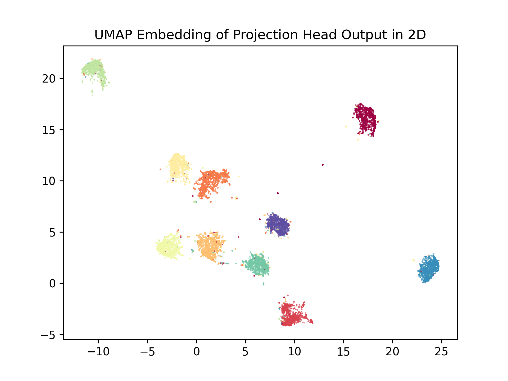

# SimCLR-Lightning
A tutorial of implementing/training/fine-tuning the SimCLR model with Pytorch `Lightning`.


The advantage of using `Lightning` is to hide miscellaneous details of training configurations such as the automatic mixed precision and distributed data parallel into the `Trainer`, wrap the model configuration (e.g., optimizers, learning rate schedulers) and `step` function of training/validating/testing/predicting loops into the `LightningModule`, and enclose dataset/dataloader setups in `LightningDataModules`.
Therefore, it allows the users to easier organize and reuse different functionalities in separate modules to decouple them and enables a much cleaner script interface.
Numerous plugins such as meters in `torchmetrics` are supported to collect batch/step or epoch-level metrics (e.g., loss and AUC) from all devices.

Details are documented in the docstring in codes.

In the example below the scripts are provided to train (self-supervised, with validation of contrastive loss), fine-tune (supervised with a subset of training data), and visualize (via UMAP embedding of projection head outputs of validation set) a resnet-backbone (default Resnet50) on CIFAR10/MNIST (default CIFAR10) dataset.
For support of other models, see `simclr_lightning.models.contrast_learning.base.AbstractBaseModel` and implement your custom models.
For support of other dataset, see `simclr_lightning.dataset.base.AbstractDataset`. For dataset in `torchvision.datasets` other than `CIFAR10` and `MNIST` see `simclr_lightning.dataset.example`

## Training and Fine-tuning
An example training scripts is provided in `simclr_lighting.scripts`

### Usage of training scripts:

At this moment, only Adam optimizer (`torch.optim.Adam`) is implemented in training and fine-tuning. For larger batch size, e.g., 1024, LARs may be used. 
Override the `simclr_lightning.models.lightning_modules.base.BaseLightningModule.configure_optimizers` to use custom optimizer and learning rate schedulers.

A ModelCheckpoint [callback](https://lightning.ai/docs/pytorch/stable/api/lightning.pytorch.callbacks.ModelCheckpoint.html) is added to the trainer to monitor the `validate_loss` field stored in the loggers in training/validation loops defined in LightningModule.
Checkpoints of top-3 models with the lowest validation contrastive loss are automatically exported to disk.
The detailed behavior of how loss is computed and logged/gathered from multiple GPUs can be found in `simclr_lightning.models.lightning_modules.simclr_wrapper.SimCLRLightning`.

Use the following command to show details of arguments (description omitted in README)
```
$ python -m simclr_lightning.scripts.train_simclr -h
usage: train_simclr.py [-h] [--export_folder EXPORT_FOLDER] [--data_root DATA_ROOT] [--dataset_name DATASET_NAME] [--out_dim OUT_DIM] [--temperature TEMPERATURE]
                       [--arch {ResNeXt101_32X8D_Weights,ResNeXt101_64X4D_Weights,ResNeXt50_32X4D_Weights,ResNet,ResNet101_Weights,ResNet152_Weights,ResNet18_Weights,ResNet34_Weights,ResNet50_Weights,Wide_ResNet101_2_Weights,Wide_ResNet50_2_Weights,resnet101,resnet152,resnet18,resnet34,resnet50,resnext101_32x8d,resnext101_64x4d,resnext50_32x4d,wide_resnet101_2,wide_resnet50_2}]
                       [--n_views N_VIEWS] [--patch_size PATCH_SIZE] [--brightness BRIGHTNESS] [--contrast CONTRAST] [--saturation SATURATION] [--hue HUE] [--blur_prob BLUR_PROB]
                       [--num_workers NUM_WORKERS] [--num_epochs NUM_EPOCHS] [--batch_size BATCH_SIZE] [--lr LR] [--max_t MAX_T] [--weight_decay WEIGHT_DECAY] [--seed SEED]
                       [--log_every_n_steps LOG_EVERY_N_STEPS] [--gpu_index GPU_INDEX [GPU_INDEX ...]] [--precision PRECISION]
... omitted
```


### Usage of Fine-tune scripts

The pretrained model with SimCLR can be fine-tuned with labeled data. Herein we use a portion of the training data (default: 30%) to finetune the pretrained model.
Similar to training, a ModelCheckpointis added to the trainer to monitor the `validate_loss` for classification of labeled data.

By default, we did not freeze any weights but layers before projection/classification heads can be frozen by set the `freeze_weight` flag in `simclr_lightning.models.lightning_modules.finetune_wrapper.FinetuneLightning`.
Details can be found in comments in the example script: `simclr_lightning.scripts.finetune_simclr`.

Use the following command to show details of arguments (description omitted in README)
```
$ python -m simclr_lightning.scripts.finetune_simclr -h
usage: finetune_simclr.py [-h] [--simclr_best_model SIMCLR_BEST_MODEL] [--data_root DATA_ROOT] [--export_folder EXPORT_FOLDER] [--dataset_name DATASET_NAME] [--train_sample_ratio TRAIN_SAMPLE_RATIO]
                          [--arch ARCH] [--out_dim OUT_DIM] [--patch_size PATCH_SIZE] [--brightness BRIGHTNESS] [--contrast CONTRAST] [--saturation SATURATION] [--hue HUE] [--num_workers NUM_WORKERS]
                          [--num_epochs NUM_EPOCHS] [--batch_size BATCH_SIZE] [--lr LR] [--max_t MAX_T] [--weight_decay WEIGHT_DECAY] [--seed SEED] [--log_every_n_steps LOG_EVERY_N_STEPS]
                          [--gpu_index GPU_INDEX [GPU_INDEX ...]] [--precision PRECISION]
                          
...omitted
```

### Prediction and Visualization
Use the following command to show details of arguments (description omitted in README)
```
python -m simclr_lightning.scripts.predict_and_visualize -h
usage: predict_and_visualize.py [-h] [--export_folder EXPORT_FOLDER] [--data_root DATA_ROOT] [--simclr_best_model SIMCLR_BEST_MODEL] [--dataset_name DATASET_NAME] [--out_dim OUT_DIM]
                                [--temperature TEMPERATURE]
                                [--arch {ResNeXt101_32X8D_Weights,ResNeXt101_64X4D_Weights,ResNeXt50_32X4D_Weights,ResNet,ResNet101_Weights,ResNet152_Weights,ResNet18_Weights,ResNet34_Weights,ResNet50_Weights,Wide_ResNet101_2_Weights,Wide_ResNet50_2_Weights,resnet101,resnet152,resnet18,resnet34,resnet50,resnext101_32x8d,resnext101_64x4d,resnext50_32x4d,wide_resnet101_2,wide_resnet50_2}]
                                [--patch_size PATCH_SIZE] [--brightness BRIGHTNESS] [--contrast CONTRAST] [--saturation SATURATION] [--hue HUE] [--num_workers NUM_WORKERS] [--num_epochs NUM_EPOCHS]
                                [--batch_size BATCH_SIZE] [--lr LR] [--max_t MAX_T] [--weight_decay WEIGHT_DECAY] [--seed SEED] [--log_every_n_steps LOG_EVERY_N_STEPS]
                                [--gpu_index GPU_INDEX [GPU_INDEX ...]] [--precision PRECISION]

```


We use [UMAP](https://umap-learn.readthedocs.io/en/latest/) to embed the features derived from pretrained model (in the example, before fine-tuning) into 2-D space and observe how the stratification of features in the plots aligned with labels.
Predictions are gathered from multiple GPUs if applicable in a custom callback derived from [BasePredictionWriter](https://lightning.ai/docs/pytorch/stable/api/lightning.pytorch.callbacks.BasePredictionWriter.html) with custom `all_gather` function. Note that by default, if distributed data parallel is enabled in multi-gpu training, and if the default `torch.utils.data.distributed.DistributedSampler` is applied, then each GPU will get a disjoint subset of data from other devices and the results from all devices should be gathered to the full output.
Details are in `simclr_lightning.models.callbacks.gather`.

By default, we only visualize the output feature of the projection head. To visualize the backbone feature before the projection head, toggle the `return_embedding` attribute in the `model` field of `simclr_lightning.models.lightning_modules.simclr_wrapper.SimCLRLightning`, which is a `simclr_lightning.models.contrast_learning.base.AbstractBaseModel` object.

The projection head feature of validation data are embedded via UMAP (details in the `simclr_lightning.scripts.predict_and_visualize`), with the data points colored by their label IDs.

An example of UMAP embedding of pretrained Resnet50-backbone features from CIFAR10 dataset is shown below:
